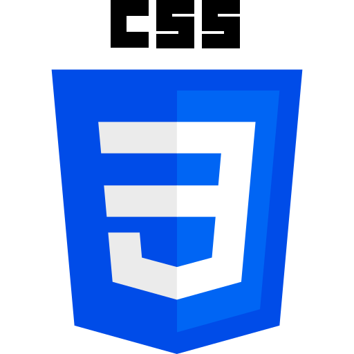
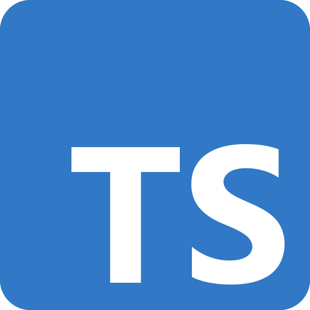
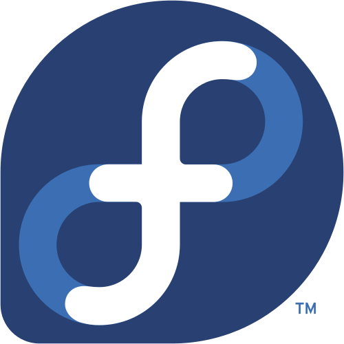

<h1>Abu Bakir </h1>

## About Me

My name is <b>Abu Bakir</b>. I am a university student and a self-taught developer with about two years of programming experience.

During my first year, I focused mainly on web development and frontend technologies. I worked with HTML, CSS, JavaScript, ReactJS, and Tailwind CSS, gaining experience in building modern web applications and understanding how frontend systems work.

Currently, I am focusing more deeply on backend development with <b>Go (Golang)</b>. I am learning how to build backend services, work with databases, design APIs, and understand the architecture behind modern web applications.

I have already worked with technologies such as <b>PostgreSQL, Redis, Apache Kafka, Gin</b>, and Go's standard <b>net/http</b> package. I am also currently studying <b>Rust</b> to deepen my understanding of systems programming and how programming languages and software work at a lower level.

I also use Linux as my primary operating system and continue improving my knowledge of the Linux environment, terminal, and underlying system concepts.

My goal is to become a strong backend developer, build reliable and scalable services, and continuously deepen my understanding of programming and computer systems.

## 🚀 My Skills

### 💻 Programming Languages

* Go (Golang)
* Rust (Learning)
* JavaScript (ES6+)

### 🌐 Frontend Development

* HTML5
* CSS3
* ReactJS
* Tailwind CSS

### ⚙️ Backend Development

* Go (Golang)
* net/http
* Gin
* PostgreSQL
* Redis
* Apache Kafka
* REST API development

### 🧰 Tools

* Git
* GitHub
* VS Code

### 🖥️ Operating Systems

* Linux (Fedora 44)
* Terminal / Shell usage

### 🧠 Currently Learning

* Deepening knowledge of Go (Golang) and backend development
* Rust programming language
* Deepening Linux knowledge

### Languages / Frameworks I'm good at:

### Languages / Frameworks I'm learning:

### Environments I work with:

## Show your support

Follow me if you like my work, or perhaps even [Sponsor Me][sponsor]?

<!-- Link anchors -->

[sponsor]: https://github.com/sponsors/default069